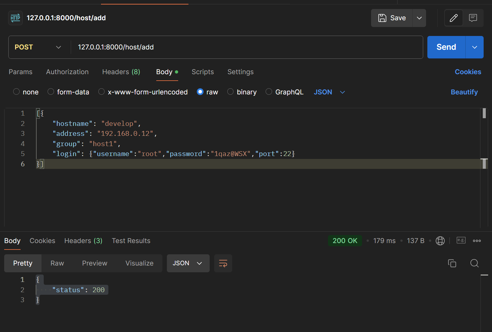

# gslave

## brief introduction

None

## use

需要两个文件 template 和values。

```yaml
taskName: "install service3"
recordLog:
  file: /var/log/mncet
executionList:
  - stage:
      name: init
      hosts: ["develop"]
      group: ["allnode"]
      mode: Command
      type: ExecuteCommand
      encounteredAnError: false
      describe:
        command: "curl 10.0.0.1/init.sh|bash"
        hostConcurrentMode: concurrent
        stepMode: "serial"
  - stage:
      name: installer nginx
      hosts: ["develop"]
      group: ["allnode"]
      mode: Command
      type: ExecuteCommand
      encounteredAnError: false
      describe:
        command: "apt-get install nginx -y"
        hostConcurrentMode: concurrent
        stepMode: "serial"
  - stage:
      name: start service
      hosts: ["develop"]
      mode: Command
      type: ExecuteCommand
      encounteredAnError: true
      describe:
        command: "java -jar app.jar"
        hostConcurrentMode: concurrent
        stepMode: "serial|background"
  - stage:
      name: init
      hosts: ["develop"]
      group: ["allnode"]
      mode: Command
      type: ExecuteCommand
      encounteredAnError: false
      describe:
        command: "apt-get install apt-file -y"
        hostConcurrentMode: concurrent
        stepMode: "serial"
  - stage:
      name: put file
      hosts: ["develop"]
      mode: File
      type: Local
      encounteredAnError: true
      describe:
        uploadFile: 
          fromNetwork: {{ .network.filepath }}
          fileSystem: {{ .file.system }}
```

```yaml
network:
  filepath: "https://10.0.0.1/app.jar"
file:
  system: "/data/installer_package/app.jar"
```

> stage 定义不同的阶段，在这里面可以定义使用不同的模块
>
> name 此阶段的名称
>
> encounteredAnError 如果此阶段遇到错误 是否继续向下执行
>
> describe 此字段需要根据使用的模块来定义。不同模块对应的字段也不相同。
>
> mode 使用的模块名称，换算到代码，就是struct的名称
>
> type 使用的函数的名称，和mode结合使用，两个组合起来就是 寻找实现了tools.Desctibe interface{}的mode内容的struct的type内容的函数。

# backend

## databases

用来定义不同的数据库

## interface


已经实现：

### `/status/information`

> 用于检查服务运行是否正常，无需传参，返回json

```
request url: 127.0.0.1:8000/status/information
request type: get
body type: nil
Passing Parameters：
	nil
return:
{
    "status": 200
}
```

### `/host/add`

> 添加主机，传递一个数组，自动循环添加
>
> hostname 和address两个有一个为必须参数 login.username login.password和login.sshKey 两个有一个为必须参数
>
> 如果提交信息有误（不包括主机名IP）可以重新提交

#### 可接受的所有参数

```golang
type Hosts struct {
	Hostname string `yaml:"hostname" bson:"hostname"`
	Address  string `yaml:"address" bson:"address"`
	Group    string `yaml:"group" bson:"group"`
	Login    struct {
		Username string `yaml:"username" bson:"username"`
		Password string `yaml:"password" bson:"password"`
		Port     int16  `yaml:"port" bson:"port"`
		SSHKey   string `yaml:"sshKey" bson:"sshKey"`
	} `yaml:"login" bson:"login"`
	HostInfo struct {
		CPU       string `yaml:"cpu" bson:"cpu"`
		Memory    string `yaml:"memory" bson:"memory"`
		Disk      []MountDisk
		TotalSize float64 `yaml:"totalSize" bson:"totalSize"`
	} `yaml:"hostInfo" bson:"hostInfo"`
	Status   string `yaml:"status" bson:"status"`
	Describe string `yaml:"describe" bson:"describe"`
}
type MountDisk struct {
	Device     string   `yaml:"device" bson:"device"`
	Name       string   `yaml:"name" bson:"name"`
	MountPoint []string `yaml:"mountpoints" bson:"mountpoints"`
	Size       int      `yaml:"size" bson:"size"`
}
```

#### demo



```
request url: 127.0.0.1:8000/host/add
request type: post
body type: raw
Passing Parameters：
[{
    "hostname": "develop",
    "address": "192.168.0.12",
    "group": "host1",
    "login": {"username":"root","password":"1qaz@WSX","port":22}
}]
return:
{
    "status": 200
}
```

### `/host/update`

> POST raw
>
> 更新主机CPU 内存信息,可选传参，不传参则更新所有，传参需要传递根据什么来进行筛选 如 hostname字段为xxx 或者address字段为 xxx

#### 可接受的所有参数

```golang
type kv struct {
	Key   string `json:"key"`
	Value string `json:"value"`
}
```


#### demo

```
传参：
```


### `/host/delete`

> 删除主机 需要传递参数 hostname or address 

#### 可接受的所有参数

```golang
type kv struct {
	Key   string `json:"key"`
	Value string `json:"value"`
}
```


#### demo

```
request url: 127.0.0.1:8000/host/delete
request type: post
body type: raw
Passing Parameters：
{
    "key":"hostname",
    "value":"develop2"
}
return:
{
    "status": 200
}
```

### `/task/add`

> 添加任务。将提交的template.yaml和values.yaml保存到database中。
>
> 仅用于提交后保存任务 不执行

#### 可接受的所有参数

```golang
type TemplateAndValues struct {
	TaskName     string `json:"taskName" bson:"taskName"`
	TemplateData []byte `json:"template" bson:"template"`
	ValuesData   []byte `json:"values" bson:"values"`
}
```


#### demo

```
request url: 127.0.0.1:8000/task/add
request type: post
body type: raw
Passing Parameters：
{
    "taskName":"install nginx",
    "template":"template...",
    "values":"values..."
}
return:
{
    "status": 200
}
```

### `/task/run`

> 用于运行指定名称的任务，会返回一个任务ID，根据任务ID可以查询任务的状态信息

#### 可接受的所有参数

```golang
type RunTask struct {
	TaskName      string `json:"taskName" bson:"taskName"`
	StartPosition string `json:"startPosition" bson:"startPosition"`
	StopPosition  string `json:"stopPosition" bson:"stopPosition"`
}
```


#### demo

```
request url: 127.0.0.1:8000/task/add
request type: post
body type: raw
Passing Parameters：
{
    "taskName":"install nginx",
    "template":"template...",
    "values":"values..."
}
return:
{
    "status": 200
}
```

### `/task/get`

> 用于请求任务的详细信息

#### 可接受的所有参数

```
?id=5
```

#### demo


## 启动配置

### 启动配置

```yaml
port: 8000
database:
  databaseType: mongodb
  # connpath和host等二选一
  connPath: mongodb://192.168.0.12:27017
  host: 192.168.0.12
  port: 27017
  # 其他参数
  authSource: 
  authType: username
  description:
    username: myUserAdmin
    password: 1qaz@WSX
  basename: mncet
login:
  username: admin
  password: admin
```


## plugin内容

必须实现接口 `tools.Desctibe`（位于tools.globalStruct.go）。

```golang
type Desctibe interface {
	// output details
	Details()
	CallMethodByType(ser *StageExecutionRecord, typeName string, args *Stage) error
}
```

### demo

```golang
type Command struct {}

func (c *Command) Details() {
	klog.Infof("model: command.")
}

func (c *Command) CallMethodByType(ser *tools.StageExecutionRecord, typeName string, arg *tools.Stage) error {
	return servertools.CallMethodByName(c, ser, typeName, arg)
}

// 开始运行的函数名称 struct名称要和yaml的mode字段完全相同 函数名称要和type字段完全相同 必须接收ser 和 data
func (c *Command) ExecuteCommand(ser *tools.StageExecutionRecord, data *tools.Stage) error {}
```

### 参数详情

#### ser *tools.StageExecutionRecord

> 用来记录每个阶段执行的状态 日志等信息

```golang
type StageExecutionRecord struct {
	TaskID     int                  `json:"taskID" bson:"ID"` // 当前阶段的任务ID
	StageInfos map[string]StageInfo `json:"stageInfo" bson:"stageInfo"` // 所有阶段的信息
	Status     string               `json:"status" bson:"status"` // 总任务的运行状态 running failed ...
}
type StageInfo struct {
	StageName         string                     `json:"name" bson:"name"` // 阶段名称
	Status            string                     `json:"status" bson:"status"` // 阶段执行状态
	HostExecuteResult map[string]StageHostStatus `json:"hostExecuteResult" bson:"hostExecuteResult"` // 此阶段所有主机的执行结果
	StageRunStatus    string                     `json:"stageRunStatus" bson:"stageRunStatus"` // 阶段运行状态
	Event             string                     `json:"event" bson:"event"` // 此阶段产生的事件
	Time              time.Time                  `json:"time" bson:"time"` // 阶段开始的时间
}
type StageHostStatus struct {
	//HostName string `json:"hostName" bson:"hostName"`
	Result string `json:"status" bson:"status"` // 命令运行的结果
	Error  string `json:"error" bson:"error"` // 产生的错误
}
```

#### arg *tools.Stage

> 用来传递用户提交的完整的yaml 包含了所有信息和完整的主机信息
>
> 此参数可以读取到非当前阶段的内容
>
> Describe中的参数为自定义参数 用来满足不同插件对于不同字段的需求

```golang
type Stage struct {
	Name               string     `yaml:"name" bson:"name"` // 阶段名称
	Hosts              []string   `yaml:"hosts" bson:"hosts"`
	HostsConn          []HostInfo `yaml:"hostsConn" bson:"hostsConn"`
	Group              []string   `yaml:"group" bson:"group"`
	Mode               string     `yaml:"mode" bson:"mode"`
	Type               string     `yaml:"type" bson:"type"`
	EncounteredAnError bool       `yaml:"encounteredAnError" bson:"encounteredAnError"`
	// 该字段根据不同的mode和type来匹配不同的值
	Describe map[string]interface{} `yaml:"describe" bson:"describe"`
}
type HostInfo struct {
	Hostname string `yaml:"hostname" bson:"hostname"`
	Address  string `yaml:"address" bson:"address"`
	Group    string `yaml:"group" bson:"group"`
	Login    Login  `yaml:"login" bson:"login"`
	HostInfo struct {
		CPU       string `yaml:"cpu" bson:"cpu"`
		Memory    string `yaml:"memory" bson:"memory"`
		Disk      []MountDisk
		TotalSize float64 `yaml:"totalSize" bson:"totalSize"`
	} `yaml:"hostInfo" bson:"hostInfo"`
	Status   string `yaml:"status" bson:"status"`
	Describe string `yaml:"describe" bson:"describe"`
}
type MountDisk struct {
	Device     string   `yaml:"device" bson:"device"`
	Name       string   `yaml:"name" bson:"name"`
	MountPoint []string `yaml:"mountpoints" bson:"mountpoints"`
	Size       int      `yaml:"size" bson:"size"`
}
```

##### Stage.Describe 字段参数绑定示例

```golang
// 声明相关的配置信息
type config struct {
	RemotePath         string
	Command            string `json:"command" yaml:"command"`
	HostConcurrentMode string `json:"hostConcurrentMode" yaml:"hostConcurrentMode"`
	StepMode           string `json:"stepMode" yaml:"stepMode"`
}
type Command struct {
	config    config
	data      *tools.Stage
	ser       *tools.StageExecutionRecord
	stageinfo *tools.StageInfo
}

func (c *Command) ParameterBinding(ser *tools.StageExecutionRecord, data *tools.Stage) {
    // 获取describe传入的所有字段
	c.config = config{
		Command:            data.Describe["command"].(string),
		HostConcurrentMode: data.Describe["hostConcurrentMode"].(string),
		StepMode:           data.Describe["stepMode"].(string),
	}
	c.data = data
	c.ser = ser
	c.stageinfo = &tools.StageInfo{HostExecuteResult: make(map[string]tools.StageHostStatus)}
}
```

#### 注意事项：

##### 1. 操作变量时不要覆盖

```golang
// 第一种 当使用此方式赋值时 会覆盖掉c.ser.StageInfos[c.data.Name]原有的所有变量！
c.ser.StageInfos[c.data.Name] = tools.StageInfo{Status: "succeed"}

// 第二种 此方式不会覆盖掉原有的变量 并且可以给字段赋值
if stageInfo, exists := c.ser.StageInfos[c.data.Name]; exists {
	// 只更新 Status 字段，保留其他字段
	stageInfo.Status = "succeed"
	c.ser.StageInfos[c.data.Name] = stageInfo
}
```


---

# 问题


# 剩余的内容

1. 实现file模块，用于从网络或者从当前主机获取文件传输到对端指定路径

2. 实现 group 主机组的功能

